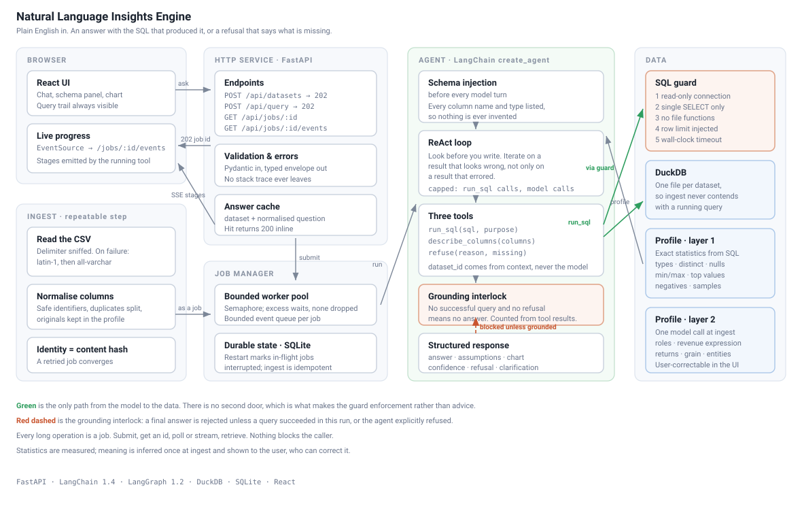

# System Design

A natural language interface over transactional CSVs. Ask in English, get an answer with
the SQL that produced it, or a refusal that says what the data would need.



Two short recordings of the running system are in the [README](README.md#asking-a-question-and-being-refused):
asking and being refused, and loading a CSV the app has never seen.

---

## 1. Components and what each owns

| Component | Owns | Does not own |
|---|---|---|
| `core/store.py` | DuckDB connections, the read-only boundary, query timeouts and row caps | What the data means |
| `core/ingest.py` | CSV to table, encoding and delimiter recovery, column name normalisation, content-hash identity | Interpretation |
| `core/profile.py` | Schema context: exact statistics, then semantic annotation | Answering questions |
| `core/guard.py` | Deciding whether a SQL string is a bounded read | Executing anything |
| `core/jobs.py` | Job lifecycle, concurrency, durability, progress events, the answer cache | Any domain logic |
| `agent/tools.py` | The only paths from model to data, and the executed-query record | Deciding what to ask |
| `agent/middleware.py` | Schema injection, the grounding interlock, usage accounting | Tool behaviour |
| `agent/agent.py` | Assembling the agent and its limits | Individual steps |
| `api/main.py` | HTTP surface, validation, status codes, the error envelope | Doing the work |
| `ui/` | Presenting the answer, the query trail, and the inferred schema | Trust decisions |

Two boundaries carry more weight than the rest.

**One DuckDB file per dataset.** DuckDB permits a single writer per file. Isolating datasets
means an upload never contends with a running query, and loading a new file during a live
demonstration cannot lock or corrupt the one being demonstrated. The cost is no cross-dataset
joins, which nothing in the brief requires.

**`run_sql` is the only door to the data.** Not a convention. There is no second code path
from the agent to DuckDB, which is what makes the guard unbypassable rather than advisory.

---

## 2. The path a question takes

1. **`POST /api/query`** validates the body, confirms the dataset exists, and checks the
   answer cache. A cache hit returns `200` with the answer inline. Anything else is queued
   and returns `202` with a job id.
2. **The job manager** acquires a slot from a bounded semaphore. Beyond that width, jobs wait
   in `queued` rather than being rejected.
3. **Schema injection** puts the dataset profile in front of the model before its first
   token. Every column name and type is listed, so the agent never guesses what exists.
4. **The agent loop** runs. It may call `describe_columns` for exact statistics at no query
   cost, `run_sql` to retrieve data, or `refuse` to decline. Each `run_sql` call is validated,
   limited, and executed on a read-only connection with a wall-clock timeout.
5. **Rejections return as tool results**, not exceptions. A rejected query is a turn the agent
   reads and corrects, not a crash.
6. **The grounding interlock** inspects any attempted final answer. Unless a `run_sql` call
   succeeded in this run, or `refuse` was called, the answer is blocked and the agent is sent
   back to work.
7. **Structured output** produces the answer, assumptions, chart proposal and confidence.
8. **The response is assembled** from the tool-boundary record rather than from the model's
   account of itself, then cached and returned.

Throughout, tools emit events through the stream writer. Those events do triple duty: server-
sent events to the browser, the query trail returned by the API, and stage labels in the trace.

### Where each error goes

| Failure | Handled by | The caller sees |
|---|---|---|
| Provider rate limit or blip | `ModelRetryMiddleware`, backoff with jitter | Nothing; it retries |
| Provider outage | `ModelFallbackMiddleware`, second model | A slightly slower answer |
| Rejected or malformed SQL | Returned as a tool result | Nothing; the agent corrects it |
| Query timeout | Tool result naming the limit | Nothing; the agent narrows the query |
| Ambiguous question | `clarification` on the response | The answer, plus the question back |
| Data cannot answer | `refuse` tool, terminal | An explicit refusal and what is missing |
| Agent will not converge | Tool and model call limits | A partial answer or a refusal |
| Unexpected exception | Logged with a trace, opaque reference returned | `500` and a reference to quote |
| Process death mid-job | Startup marks the job `interrupted` | A job that says so, not a hang |

---

## 3. How schema context is built from an unfamiliar file

Two layers, deliberately separated, because one is a measurement and the other is a judgment.

**Layer 1, statistics.** One SQL pass at ingest. Per column: type, null rate, exact distinct
count, minimum, maximum, sample values, most common values, and whether it contains negatives.
No model, no heuristics. On the 511,000-row development file this takes about 150 milliseconds.

This layer exists because it is cached exploration. Without it the agent spends five to ten
queries per question rediscovering the shape of a file that has not changed.

**Layer 2, semantics.** One model call at ingest reads layer 1 and returns a role and a
description per column, plus table-level notes: how monetary value is computed, whether
returns are present and how to treat them, the transaction grain, the time column, and which
columns identify customers, products and locations.

There is no keyword or regex rule anywhere in this. A list of English money words compiled
into the source would be exactly the dataset-specific assumption this system must not contain,
and it misleads the agent whenever it guesses wrong. Running the pass once per dataset rather
than once per question means every question shares one stable interpretation of the data.

It fails soft. Without a key, or on a malformed response, the dataset keeps layer 1, and the
prompt tells the agent to infer meaning from the statistics itself.

### Evidence that it generalises

The second sample file shares nothing with the development file: different domain, different
column names, semicolon delimited, dates as `DD/MM/YYYY`, no precomputed revenue column, and
cancellations expressed as negative day counts rather than a flag. With no code changes:

```
revenue_expression : hire_days * day_rate_gbp        (derived, not read from a column)
has_returns        : true
returns_note       : negative hire_days indicate cancellations
grain              : one row per equipment hire booking
time_column        : booked_on
entities           : customer=account_ref, product=asset_ref, location=depot
```

### Where it breaks

- **Opaque names with uninformative samples.** `col_a`, `col_b`, all integers. Layer 2 has
  nothing to reason from. It says so in `caveats`; it does not invent.
- **Pre-aggregated files.** A file of monthly totals looks transactional. Summing a
  pre-summed column double counts and nothing detects it.
- **Several plausible date columns.** Booked, shipped, invoiced. One is chosen and stated,
  and it may be the wrong one for a given question.
- **Mixed currency.** Amounts summed across currencies with no rate column produce a number
  with no meaning.
- **One table only.** No joins across files, no foreign key inference.
- **A single point of judgment.** If layer 2 misreads the file, every question inherits the
  error. This is the reason the inferred roles are rendered in the UI and are correctable in
  place through `PATCH /api/datasets/{id}/columns/{column}`. The failure is visible and
  fixable rather than silent.

---

## 4. The four decisions that shaped this, and what was rejected

### 4.1 A constrained ReAct agent, not a fixed pipeline

**Chosen.** A tool-calling loop with hard limits, over LangChain's `create_agent`.

**Rejected: a fixed generate-then-execute pipeline.** It was the first design. On a file it
has never seen, the agent needs to look before it writes: check how a country is spelled,
whether an invoice spans multiple rows, whether negative quantities exist. A pipeline only
reacts to *errors*, so a query that succeeds and returns something meaningless reaches the
user unchallenged. That is the failure mode that destroys trust, and it is invisible.

**Rejected: Deep Agents.** Its value is planning, a virtual filesystem, and subagent
delegation. This agent runs two to five turns over one table. There is no plan to persist, no
artifact to write, and nothing to delegate. It would add latency to every prompt for capability
that never runs.

**The cost of ReAct is variance** in loop length, latency and spend. That is paid for
explicitly: a cap on `run_sql` calls per question, a cap on model calls, a recursion backstop,
and streamed progress so the wait is legible rather than blank.

**Why it survives contact with a changing brief.** A new capability is a new tool, not a
re-plumbed graph. When a stakeholder asks for something unforeseen, the change lands in one
file and one line of the agent's tool list.

### 4.2 Refusal is a tool, and answers are interlocked

**Chosen.** `refuse(reason, missing_concepts)` is a real tool call, and an `after_model` hook
blocks any final answer that is not backed by a successful query or an explicit refusal.

**Rejected: instructing the model to refuse in the prompt.** A refusal that is merely the
absence of an answer cannot be observed, tested, or measured. As a tool call it is structured,
logged, visible in the trace, and directly assertable in the evaluation suite. Seven of the
twenty-one evaluation questions pass only by refusing.

**Rejected: a post-hoc hallucination check.** Grading the answer after the fact is another
model call and another thing to be wrong. The interlock is mechanical: no successful query in
this run and no refusal means no answer, enforced in code. It counts tool results, never the
model's account of what it did.

### 4.3 The statistics layer is not the semantics layer

**Chosen.** Exact statistics from SQL, then one model call for meaning, persisted at ingest.

**Rejected: rule-based role inference.** Matching column names against `price|amount|revenue`
is a hardcoded English word list, which the brief forbids in spirit and which is wrong often
enough to be harmful. A column called `value` is usually a category; a column called `total`
is often a count. A wrong role misleads the agent, which is worse than no role at all.

**Rejected: letting the agent infer meaning per question.** It would redo the judgment on
every request and could define revenue two different ways for two different questions asked
five minutes apart. A merchandising team cannot work with that.

**Rejected: a semantic layer with a metrics DSL.** Dimensions, measures and a modelling
language is a second product, and none of it is needed to answer the questions in the brief.

### 4.4 DuckDB per dataset, and one process

**Chosen.** One embedded DuckDB file per dataset, one FastAPI process, a bounded asyncio pool,
and job state in SQLite.

**Rejected: Postgres.** The development file is 75 MB. DuckDB reads it directly, needs no
server, and keeps clone-to-working-endpoint inside the fifteen-minute budget.

**Rejected: Celery, Redis, or a message broker.** They would answer a question about scale
that this workload does not ask, and they would make setup a multi-service problem. The
ceiling is stated below rather than built past.

**Rejected: a single database with a table per dataset.** DuckDB has one writer per file, so
that design makes every ingest contend with every query. Separate files remove the contention
entirely at the cost of cross-dataset joins, which nothing needs.

---

## 5. Behaviour under load and partial failure

**Concurrent load.** A semaphore caps in-flight jobs; the rest wait in `queued`. Query
execution is milliseconds, so wall time is dominated by model round trips, which are IO-bound
and interleave well on one event loop. Reads across datasets never contend because each
dataset is a separate file. Two uploads of *different* files are independent. Two uploads of
the *same* file converge, because identity is the content hash.

**Partial failure.** Job state is in SQLite, not memory. On startup, any job still marked
`running` or `queued` becomes `interrupted` with a message saying so, because we cannot know
whether it finished. Ingest is idempotent, so resubmitting is safe. A failed ingest deletes
its half-written database file rather than leaving a dataset that half exists. Event queues
are bounded: a slow or vanished browser drops progress events rather than stalling the job,
and the terminal state is always readable from the database.

**What is not covered.** A single process is a single point of failure. Nothing resumes an
interrupted question automatically. Both are addressed in section 7.

---

## 6. Guardrails, and how we know they hold

**Layered SQL safety**, outermost first, because the layers are not equally strong.

1. A read-only DuckDB connection. It cannot be talked around by a prompt injection or by a
   syntax we failed to anticipate. This is the enforcement.
2. Parse checks: exactly one statement, `SELECT` only, no writes, no table functions, no
   file-reading functions, and every referenced table must be the dataset table.
3. A textual sweep for file-reading function names, because `sqlglot` gives some of them
   dedicated node classes rather than the generic function node, and a future dialect update
   could add more.
4. An injected row limit, clamped if the model asks for more.
5. A wall-clock timeout that interrupts the connection.

Twenty-five attack strings are in the test suite, covering writes, stacked statements, local
file reads, exfiltration, extension loading and cross-table access.

**Grounding.** No answer without a successful query or an explicit refusal, counted from tool
results rather than model claims.

**Transparency as a guardrail.** Every answer carries the queries that produced it, their row
counts and timings, and the assumptions the agent made. A merchandiser who can read the query
can challenge it. This is the difference between an answer and a claim.

**The evaluation set.** Twenty-one questions in `eval/questions.yaml`, seven of which must be
refused and one of which must name a gap in the data rather than reason across it. Expected values were computed directly with DuckDB and the derivation is recorded
alongside each question. Assertions compare *values* with a tolerance, never SQL text: the
agent writes a different but equivalent query every run, so pinning the query would test the
wrong thing. Tolerances are wide where a measure is genuinely ambiguous and tight where it is
not. `make eval` exits non-zero on regression.

### What the evaluation set actually caught

Two findings, both from questions that failed, and both worth more than the ones that passed.

**The agent was right and the question was wrong.** `country_growth` originally asked for
growth between the third and fourth quarter of 2011. The agent refused, because the data
stops on 30 November and 2011-Q4 is two thirds of a quarter. Comparing it against a complete
quarter and reporting the difference as growth is a confidently wrong answer. The question
was rewritten to compare two complete quarters, and the original became a separate test.

**That separate test then exposed real flakiness.** Across three runs the agent refused
once, answered with the truncation flagged once, and answered without mentioning it once.
The third is a genuine failure: a plausible number a merchandiser would act on. Two changes
fixed it. The compact profile now carries the time column's actual range rather than only
its name, so judging coverage costs no tool call. And the prompt now separates three cases
by name: fully covered, not covered, and partially covered, with the last requiring the
truncation to be stated in the answer and in the assumptions. Three consecutive runs after
the change flagged it every time.

The assertion was also widened. Refusing and answering-with-the-caveat are both correct;
only silently comparing is wrong. Pinning the test to whichever behaviour appeared on the
day would have tested the wrong thing.

**The test suite** covers what would be frightening to change: the profiler against hostile
CSVs (semicolon delimited, latin-1, duplicate headers, header-only, single-row, all-null
column, type-defeating column), every attack string against the guard, the job lifecycle
including restart recovery and backpressure, the API contract and error envelope, and the
grounding interlock against constructed histories. It makes no network calls, so it runs
anywhere in about a second.

---

## 7. What I would build next, in order

1. **Postgres for job state and checkpoints.** The SQLite checkpointer is documented as only
   partially production ready, and one process is one point of failure. This is the change
   that makes horizontal workers possible, and everything below is easier after it.
2. **Resume an interrupted question.** The checkpointer already holds the state; nothing
   currently picks a thread back up after a restart. Job state and the thread need to be
   reconciled on startup.
3. **Column ranking for very wide files.** The compact profile lists every column. Past a few
   hundred columns that stops being affordable, and the profile needs ranking against the
   question before injection.
4. **A held-out evaluation set and per-question regression tracking.** Twenty questions on
   two datasets is enough to catch obvious breakage, not enough to detect a prompt change
   that costs three points of accuracy. Store every run, compare against the last.
5. **Cross-dataset joins.** Requires a real catalogue and foreign key inference. Worth doing
   only when someone asks a question that needs it.
6. **Query result streaming for large answers.** Results are capped and truncated today. Real
   export needs pagination or a download endpoint.
7. **Cost budgets per question and per dataset.** Usage is already tracked per run; enforcing
   a ceiling is small once someone decides what the ceiling should be.

---

## 8. What was cut, and why

- **Token-by-token answer streaming.** Stage-level progress is what makes a fifteen-second
  wait legible. Streaming the closing paragraph on top of that adds very little.
- **Authentication, multi-tenancy, cloud deployment.** Explicitly out of scope.
- **A semantic metrics layer.** Section 4.3.
- **Horizontal workers and a broker.** Section 4.4, with the ceiling stated in section 5.
- **A second opinion on every answer.** A critic pass would roughly double latency and cost
  for a check the grounding interlock and the visible query trail already largely provide.
