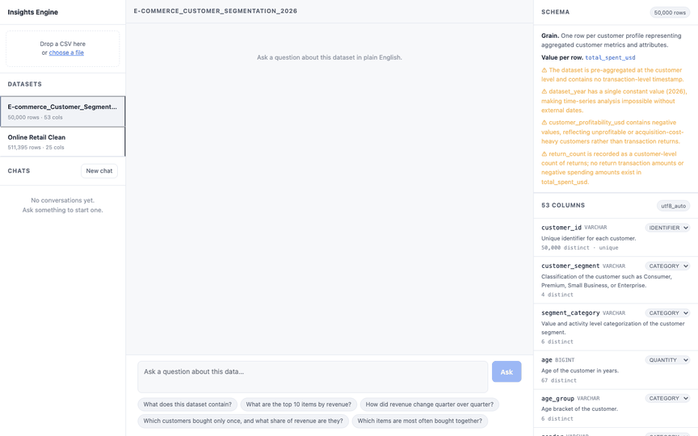
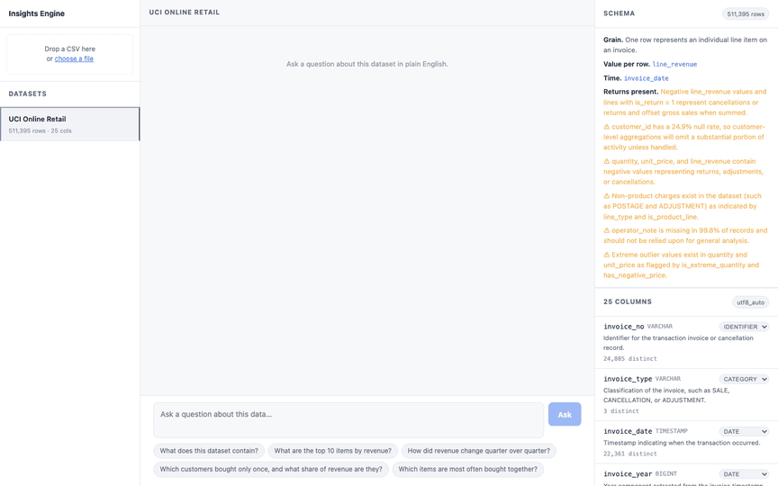
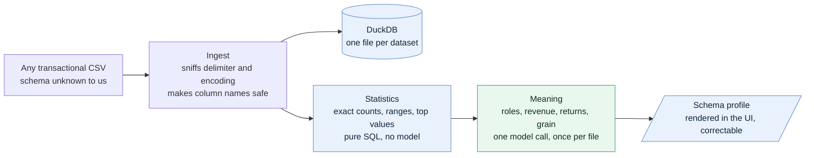
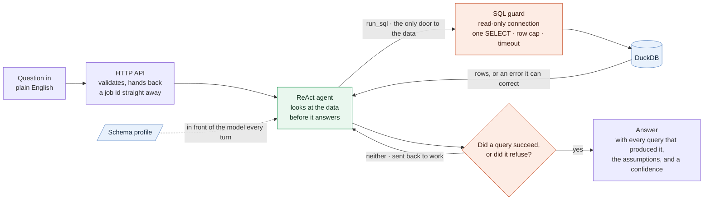

# Natural Language Insights Engine

Ask questions about a transactional CSV in plain English. Get an answer with the SQL that
produced it, or a refusal that says what the data would need.

Point it at a CSV it has never seen and it will work out the schema for itself. No code
changes, no configuration, nothing about any particular dataset baked in.

**[System design and architecture →](DESIGN.md)**

### Asking a question, and being refused



A question it can answer, with the queries that produced it. Then a question about profit
margin, which this data cannot support, so it declines and says what is missing.

### Loading a CSV it has never seen



A different domain, semicolon delimited, `DD/MM/YYYY` dates, and no revenue column. The
schema panel fills in on its own and the next question is answered against it. No code
changes, no restart.

---

## Quick start

Requires [uv](https://docs.astral.sh/uv/), Node 20 or newer, and a Google Gemini API key.

```bash
git clone <this-repo> && cd nl-insights-engine
make setup                       # venv, dependencies, UI build, .env
echo "GEMINI_API_KEY=your-key" >> .env
make dev                         # http://localhost:8000
```

In another terminal, load the sample data:

```bash
make seed
```

Then open http://localhost:8000, pick a dataset, and ask something.

`samples/plant_hire.csv` ships with the repo. The UCI Online Retail file is about 79 MB and
is published separately, so it is not vendored here. Drop it in the project root as
`online_retail_clean.csv` and `make seed` will pick it up, or upload any CSV of your own
through the UI. Nothing in the code depends on either file.

### Or with Docker

```bash
echo "GEMINI_API_KEY=your-key" > .env
docker compose up --build        # http://localhost:8000
```

---

## Asking a question

Through the UI, or over HTTP. Every long operation is a job: submit, get an id, poll or
stream, retrieve.

```bash
# 1. Load a CSV
curl -X POST localhost:8000/api/datasets -F "file=@samples/plant_hire.csv"
# → 202 {"job_id": "...", "poll_url": "...", "stream_url": "..."}

# 2. Ask
curl -X POST localhost:8000/api/query \
  -H 'content-type: application/json' \
  -d '{"dataset_id":"<id>","question":"Which depot generated the most revenue?"}'
# → 202 {"job_id": "..."}

# 3. Watch it work
curl -N localhost:8000/api/jobs/<job_id>/events

# …or just poll
curl localhost:8000/api/jobs/<job_id>
```

Every question runs the agent. There is no answer cache, so asking the same thing twice
does the work twice and you see it happen. Pass `"thread_id": "<id>"` from a previous
answer to ask a follow-up in the same conversation.

Conversations are addressable. `/api/threads` lists them, titled by the question that
started each one, and the UI keeps them in the left rail so you can switch between several
lines of enquiry against the same dataset. There is no separate threads table: every
question is already a job row carrying its thread id, so the job log *is* the conversation
log and the two cannot disagree.

Interactive API documentation is at `/docs`.

### Endpoints

| Method | Path | Purpose |
|---|---|---|
| `POST` | `/api/datasets` | Upload a CSV. Returns a job. |
| `GET` | `/api/datasets` | List loaded datasets |
| `GET` | `/api/datasets/{id}` | Full profile: statistics and inferred meaning |
| `PATCH` | `/api/datasets/{id}/columns/{column}` | Correct an inferred column role |
| `DELETE` | `/api/datasets/{id}` | Remove a dataset |
| `POST` | `/api/query` | Ask a question. Returns a job. |
| `GET` | `/api/threads` | List conversations, newest first. Filter with `?dataset_id=` |
| `GET` | `/api/threads/{id}` | Replay a conversation: every question with its answer |
| `DELETE` | `/api/threads/{id}` | Forget a conversation, log and agent memory both |
| `DELETE` | `/api/threads` | Forget every conversation. `?dataset_id=` scopes it |
| `GET` | `/api/jobs/{id}` | Job status and result |
| `GET` | `/api/jobs/{id}/events` | Server-sent progress events |
| `GET` | `/health` | Readiness and configuration |

Errors are always shaped the same way, and never contain a stack trace:

```json
{"error": {"code": "not_found", "message": "Dataset 'abc' not found"}}
```

---

## How it works

Two flows. Loading a file happens once. Asking a question happens every time.

### Loading a file



Statistics are measured and meaning is inferred, and the two are kept apart on purpose. The
statistics are exact and cost nothing to trust. The meaning is one judgment, made once so
that every later question shares it, and shown to you so a wrong call is visible rather than
silent. Without an API key the profile keeps its statistics and the system still works.

### Answering a question



The two loops are the whole design. The agent can query, read the result, and query again,
which is what lets it work on a file it has never seen. And it cannot leave the loop with an
answer unless a query actually succeeded or it explicitly refused.

The agent has two other tools not drawn here, because they do not touch the database.
`describe_columns` serves the cached statistics at no query cost, and `refuse` declines the
question as a structured, logged action.

[The full architecture and the reasoning behind it →](DESIGN.md)

---

## What it does about being wrong

**It shows its working.** Every answer carries the queries that produced it, their row
counts and timings, and the assumptions the agent made. An answer you can check is worth
more than one you cannot.

**It cannot answer without querying.** A middleware hook blocks any final answer unless a
query actually succeeded in that run, or the agent explicitly refused. This is enforced in
code and counted from tool results, not asked for in a prompt.

**Refusing is a real action.** `refuse` is a tool the agent calls, so a refusal is
structured, logged, and testable. Seven of the twenty-one evaluation questions pass only by
being refused, and one more passes only by naming a limitation in the data it was asked to
reason across.

**SQL cannot escape the dataset.** Queries run on a read-only connection, which is the
enforcement, behind parse checks that reject writes, stacked statements, file-reading
functions and any table other than the dataset. Twenty-five attack strings are in the tests.

---

## Any CSV

`samples/plant_hire.csv` deliberately shares nothing with the development dataset: different
domain, different column names, semicolon delimited, `DD/MM/YYYY` dates, no precomputed
revenue column, and cancellations expressed as negative day counts. Loading it produces:

```
revenue_expression : hire_days * day_rate_gbp     ← derived, not read from a column
has_returns        : true, negative hire_days are cancellations
grain              : one row per equipment hire booking
time_column        : booked_on
entities           : customer=account_ref, product=asset_ref, location=depot
```

The inferred roles appear in the schema panel and can be corrected there. Schema inference
that is visible and fixable beats schema inference that is silently wrong.

---

## Development

```bash
make test        # 112 tests, no network, about a second
make lint        # ruff
make eval        # 21 questions against a running server
make ui          # Vite dev server on :5173 with hot reload
make help        # everything else
```

The test suite makes no model calls. A test that needs the network is a test that fails on
someone else's machine.

`make eval` needs a running server and a key. It exits non-zero on regression, and asserts
on values with a tolerance rather than on SQL text, because the agent writes a different but
equivalent query on every run.

---

## Configuration

Everything is environment driven. See `.env.example`.

| Variable | Default | Purpose |
|---|---|---|
| `GEMINI_API_KEY` | — | Required |
| `LLM_MODEL` | `google_genai:gemini-3.8-flash` | Any provider string LangChain accepts |
| `LLM_FALLBACK_MODEL` | `google_genai:gemini-2.5-flash` | Used if the primary fails |
| `LLM_REASONING_EFFORT` | `medium` | Thinking budget: `low`, `medium` or `high`. See below. |
| `JOB_CONCURRENCY` | `4` | In-flight jobs; the rest queue |
| `MAX_RESULT_ROWS` | `1000` | Row cap per query |
| `QUERY_TIMEOUT_S` | `30` | Wall-clock cap per query |
| `AGENT_MAX_SQL_CALLS` | `6` | Queries per question |
| `AGENT_MAX_MODEL_CALLS` | `16` | Model turns per question |
| `MAX_UPLOAD_MB` | `512` | Upload size limit |
| `LANGSMITH_TRACING` | `false` | Set with `LANGSMITH_API_KEY` for traces |

### Thinking budget

The model thinks before answering, and that thinking is most of the output token cost. It
also drives extra turns, because a model that deliberates more explores more.
`LLM_REASONING_EFFORT` controls it, and the levels were measured against the full
evaluation set rather than guessed:

| | low | medium (default) |
|---|---|---|
| evaluation result | 21/21 | 21/21 |
| refusals correct | 7/7 | 7/7 |
| wall clock for the set | 171s | 296s |
| median question | 6.1s | 11.1s |
| sample question, tokens | 5,493 in / 585 out | 14,826 in / 2,397 out |

`medium` is the default. `low` is roughly half the latency and a third of the tokens with
no measured loss, including on the two questions that need care: the one-purchase customer
share, and the comparison against a truncated quarter. Twenty-one questions is enough to
show no regression, not enough to prove robustness on questions nobody has asked, which is
the only reason `low` is not the default.

`minimal` is rejected by `gemini-3.8-flash`.

Switching provider is one line. `LLM_MODEL=anthropic:claude-sonnet-5` with the matching key
and package works without touching any code.

---

## Layout

```
app/core/      store, ingest, profile, guard, jobs   — no model in the path except profile layer 2
app/agent/     tools, middleware, prompts, assembly
app/api/       FastAPI service
ui/            React + Vite
eval/          questions.yaml + run_eval.py
tests/         112 tests, hermetic
docs/          architecture diagram
```

## Known limits

Stated plainly, and expanded in [DESIGN.md](DESIGN.md).

- One process. Concurrency is a bounded pool, not horizontal workers.
- One table per dataset. No joins across files.
- An interrupted question is reported as interrupted, not resumed automatically.
- Very wide files put every column in the prompt; past a few hundred columns that needs ranking.
- Semantic annotation is a single point of judgment. It is shown to the user and correctable,
  which is the mitigation, not a fix.
